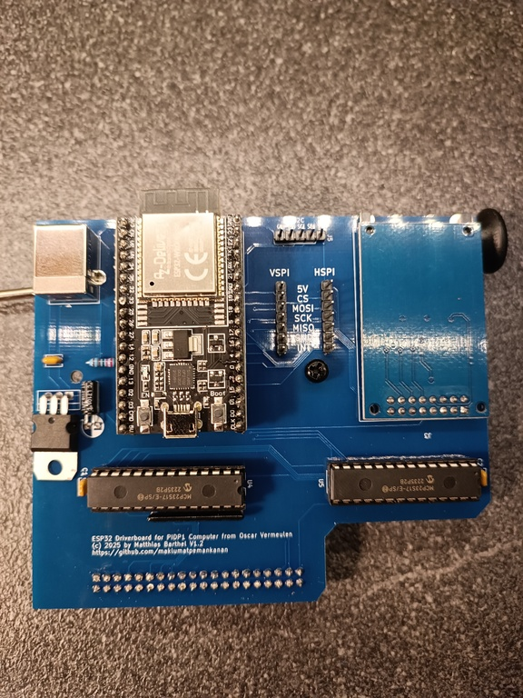
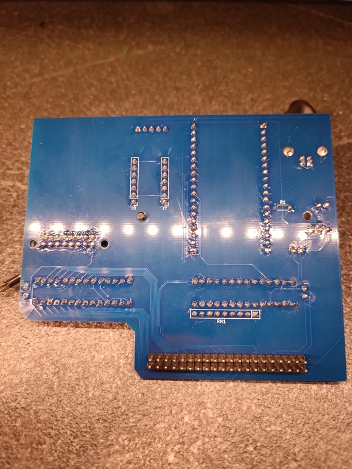
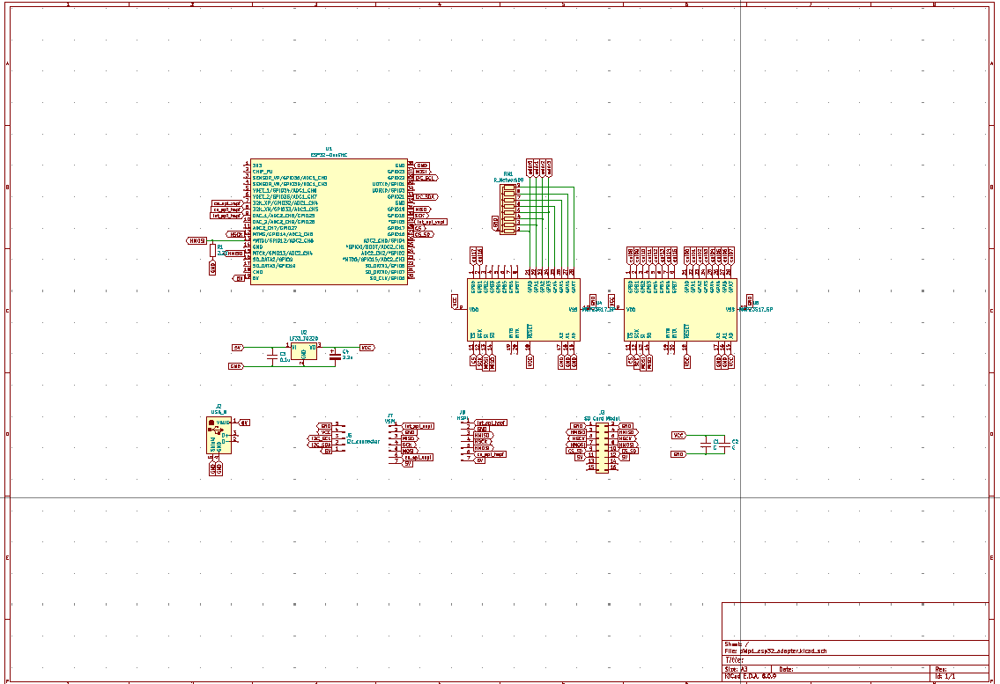

## ESP32-PiDP1-Adapter

this is a Hardware-Modification for the [PiDP1-Computer from Oscar Vermeulen]([PiDP-1](https://obsolescence.dev/pdp1.html)).

its compatible to the Console-Kit and the Rack-Kit. 

the ESP32-Controller can drive the complete Matrix of the PiDP1 with 2 MCP23S17-Expanders via the SPI-Bus. You don't need a Raspberry anymore to work with your PiDP1 :wink:

The Adapter support SD-Card for Fileloading into the Simulator and for other purposes (eg. Webserver). Also a few Pinsocket are availible for the IoT-Backplane and other future Projects (see the Pinout-Section).

The ESP32-PiDP1-Adapter is full compatible to my ESP-PDP1-Simulator-Code in my Git.
You can use this Code or build your own with this Board.

## Software

:white_check_mark: its ready for use with the ESP-PDP1-Code from my Git. Please remind i dont know if all Opcodes and Functions of the ESP-PDP1 are correct implemented - its a hobby project! 

## Pinout

| **SD Card (HSPI)**          |        |                      |
| --------------------------- | ------ | -------------------- |
| MISO                        | Gpio13 |                      |
| MOSI                        | Gpio12 | must be LOW at boot! |
| SCK                         | Gpio14 |                      |
| CS                          | Gpio16 |                      |
|                             |        |                      |
| **LEDs / Switches (VSPI)**  |        |                      |
| MISO                        | Gpio19 |                      |
| MOSI                        | Gpio23 |                      |
| SCK                         | Gpio18 |                      |
| CS                          | Gpio17 |                      |
|                             |        |                      |
| **AUX-SPI-Connector1**      |        |                      |
| MISO                        | Gpio19 |                      |
| MOSI                        | Gpio23 |                      |
| SCK                         | Gpio18 |                      |
| CS                          | Gpio32 |                      |
| INT                         | Gpio25 |                      |
|                             |        |                      |
| **AUX-SPI-Connector2**      |        |                      |
| MISO                        | Gpio13 |                      |
| MOSI                        | Gpio12 |                      |
| SCK                         | Gpio14 |                      |
| CS                          | Gpio33 |                      |
| INT                         | Gpio05 |                      |
|                             |        |                      |
| **AUX-I2C-Connector**       |        |                      |
| SDA                         | Gpio21 |                      |
| SCL                         | Gpio22 |                      |
|                             |        |                      |
| **MAPPING LEDS / SWITCHES** |        |                      |
| **MCP#0**                   |        |                      |
| GPA0                        | 21     | addr0                |
| GPA1                        | 22     | addr1                |
| GPA2                        | 23     | addr2                |
| GPA3                        | 24     | addr3                |
| GPA4                        | 25     | -                    |
| GPA5                        | 26     | -                    |
| GPA6                        | 27     | -                    |
| GPA7                        | 28     | -                    |
|                             |        |                      |
| GPB0                        | 1      | col17                |
| GPB1                        | 2      | col16                |
| GPB2                        | 3      | -                    |
| GPB3                        | 4      | -                    |
| GPB4                        | 5      | -                    |
| GPB5                        | 6      | -                    |
| GPB6                        | 7      | -                    |
| GPB7                        | 8      | -                    |
|                             |        |                      |
| **MCP#1**                   |        |                      |
| GPA0                        | 21     | col00                |
| GPA1                        | 22     | col01                |
| GPA2                        | 23     | col02                |
| GPA3                        | 24     | col03                |
| GPA4                        | 25     | col04                |
| GPA5                        | 26     | col05                |
| GPA6                        | 27     | col06                |
| GPA7                        | 28     | col07                |
|                             |        |                      |
| GPB0                        | 1      | col08                |
| GPB0                        | 2      | col09                |
| GPB0                        | 3      | col10                |
| GPB0                        | 4      | col11                |
| GPB0                        | 5      | col12                |
| GPB0                        | 6      | col13                |
| GPB0                        | 7      | col14                |
| GPB0                        | 8      | col15                |

## Schematics

the PDF-File of the Schematics included in the Pictures-Folder.

## Gerber-Files

the Gerber-Files are ready for order and availible in the gerbers-folder. 
:heavy_exclamation_mark: if anyone have interesst on a Kit for the Adapter or a assembled and tested Version, feel free to contact me.

## Part List

| Amount | Description                                                | Reference                    |
| ------ | ---------------------------------------------------------- | ---------------------------- |
| 2      | IC-Socket DIP28                                            | U4,U5                        |
| 2      | MCP23S17 DIP28                                             | U4,U5                        |
| 3      | CAP 100nF                                                  | C1,C2,C3                     |
| 1      | Elyt 2.2yF 50V                                             | C4                           |
| 1      | Resistor 2.2K                                              | R1                           |
| 1      | [SD-Card_module SPI](https://www.ebay.de/itm/232483258885) | J3                           |
| 1      | LF33CV                                                     | U2                           |
| 1      | Resistor Network 8x10K                                     | RN1                          |
| 1      | USB/B-Connector                                            | J2                           |
| 2      | Pinsocket 19 Pin                                           | U1                           |
| 1      | Pinheader 2x20                                             | RPI-Pins (Place on the Back) |
| 2      | Pinheader 1x7                                              | VSPI, HSPI-Connector         |
| 1      | Pinheader 1x5                                              | I2C-Connector                |

## License

MIT License

## Author

(c) 2025 Matthias Barthel
